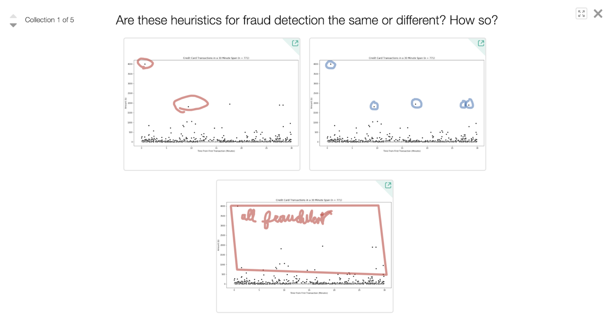
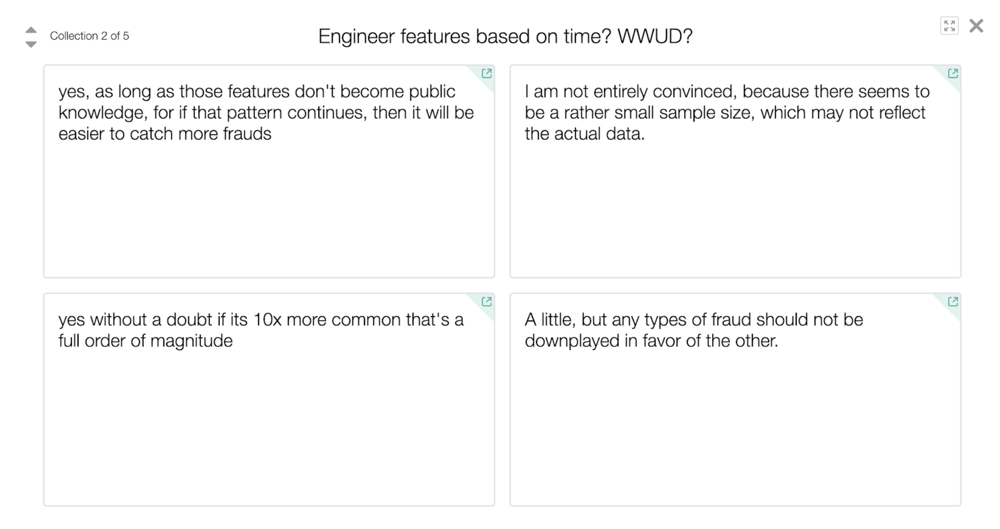
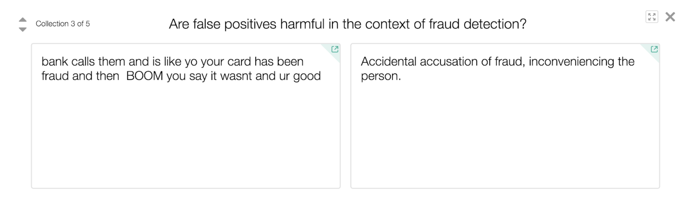

# Session 04: Utility

- (15 mins) Review
- (60 mins) Case Study

## (15 mins) Review

Consider starting with a peer instruction question on a topic that students struggled with from the first three sessions or while working on the competition.

Show the public leaderboard for the Kaggle competition. Explain that the F1-score on this leaderboard may be higher than students’ F1-score on their validation set because the public leaderboard includes all of the training data, not just the validation data.

Share the results of the private leaderboard for the Kaggle competition, where the F1-score is only based on the test (hold-out) set. Congratulate all students for their work. Highlight some interesting ideas or questions from students whose teams did not make the top three to demonstrate to students that their Kaggle leaderboard ranking does not define their worth as a machine learning practitioner.

## (60 mins) Case Study

Before starting the case study, define utilitarianism. [Slides](https://docs.google.com/presentation/d/18YLnUL4r4q-bp9l8a9VynJb7gf0wXnyN8wnhBLyjTsg/edit#slide=id.g4c29fe321c_0_5) include an introduction to Jeremy Bentham’s criteria for evaluating pleasure and pain that could result from a decision.

This case study was written by Vinesh Kannan, based on the credit card fraud dataset from [the Machine Learning Group of Université Libre de Bruxelles](http://mlg.ulb.ac.be/), retrieved from [Kaggle](https://www.kaggle.com/mlg-ulb/creditcardfraud).

To prepare for this lesson as an instructor, preview [the activity on Desmos](https://teacher.desmos.com/activitybuilder/custom/5c342473ab76240f4a4848ab). Consider deleting some parts of the activity for time purposes. Decide where you want to restrict screens to keep students from seeing later parts of the case study.

Click “Create Class Code” to get a class code to give to your students in class. In this activity, students will:

- Brainstorm features for detecting credit card fraud
- Predict where credit card fraud is more frequent
- Quantify the cost of errors for fraud detection
- Critique suggestions for task-specific model evaluation metrics
- Select a fraud detection model based on competing metrics
- Analyze the performance of models based on new data

[Slides](https://docs.google.com/presentation/d/18YLnUL4r4q-bp9l8a9VynJb7gf0wXnyN8wnhBLyjTsg/edit#slide=id.g4c29fe321c_1_376) also include plots showing how three different sampling methods (random undersampling, random oversampling, and SMOTE) affect the training samples. Sampling methods for dealing with imbalanced class distributions were removed from this case study to preserve time and because none of them appeared to be effective for the credit card fraud detection challenge.

While students work on the activity on Desmos, use [the snapshots feature](http://blog.mrmeyer.com/2018/orchestrate-more-productive-mathematics-discussions-with-desmos-snapshots/) to save examples of interesting student responses and overlay a new discussion question on each collection of responses. When the activity is paused, or at the end of the case study, discuss the collections of snapshots with the entire class. For example:

When students predict which transactions from the scatter plots they think are fraudulent, compare sketches to probe about what kinds of implicit or explicit rule students are declaring.

When students are asked if and how time should be incorporated into the fraud detection model, compare different responses and ask students which responses a utilitarian might agree with.

When students are asked to quantify the cost of errors in fraud detection, discuss how they describe about false positives.

When students are asked to quantify errors, discuss how they come up with their numbers.

**Next:** [Fairness I](session05.md)
